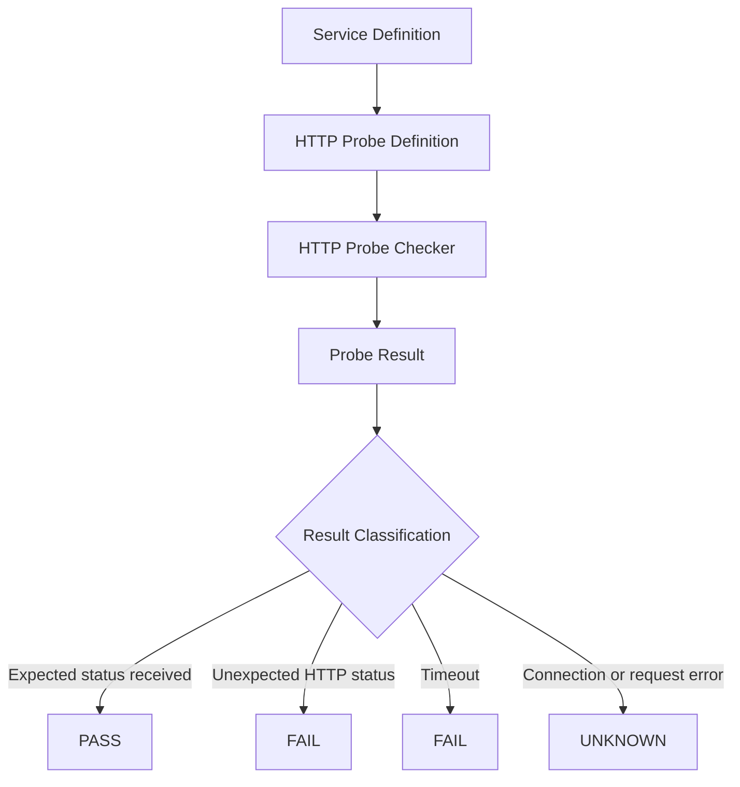
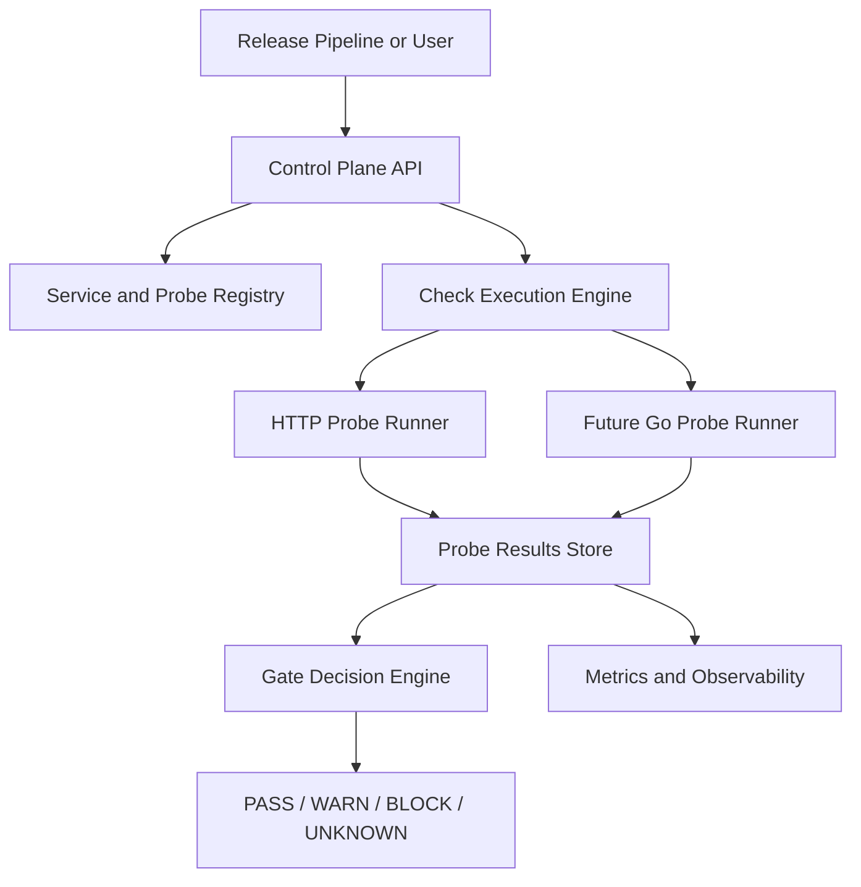

# Architecture

## Purpose

Platform Reliability Control Plane is intended to model release and environment reliability gates.

The system should eventually help answer this question:

> Is a service or environment healthy enough for a release or promotion to continue?

The current Week 1 implementation is intentionally small. It focuses only on the core reliability-checking slice: defining a service, defining an HTTP probe, running the probe, and classifying the result.

This keeps the first implementation testable and understandable before adding APIs, persistence, scheduling, observability, Docker, Kubernetes, or a Go probe runner.

## Current Architecture

The current system has two Python modules:

```text
src/prcp/
  models.py
  checker.py
```

`models.py` defines simple structures for services, probes, probe results, statuses, and failure reasons.

`checker.py` contains the first execution path: run an HTTP check and return a classified probe result.



## Components

### Service Model

A service represents a deployable or reachable system that belongs to an environment.

Current fields:

```text
name
environment
base_url
```

Valid environments are:

```text
dev
preprod
prod
```

The model performs basic validation so invalid service definitions are rejected early.

### HTTP Probe Model

An HTTP probe represents one check against a service endpoint.

Current fields:

```text
service_name
url
expected_status_code
timeout_seconds
```

The default expected status code is `200`.

The default timeout is `2.0` seconds.

### Probe Result Model

A probe result represents the outcome of running a probe.

Current fields:

```text
service_name
status
actual_status_code
failure_reason
latency_ms
```

The result keeps both the high-level status and the lower-level failure reason. This is important because a release gate should not treat all failures as the same.

### HTTP Checker

The HTTP checker is responsible for:

```text
1. Reading the probe definition
2. Calling the target URL
3. Measuring latency
4. Comparing actual status code with expected status code
5. Returning a classified probe result
```

The checker does not store results, expose an API, schedule checks, or make gate decisions yet.

## Data Flow

The current flow is:

```text
create_service()
      |
      v
create_http_probe()
      |
      v
http_check()
      |
      v
create_probe_result()
```

A caller creates a service definition, creates a probe for that service, runs the probe through `http_check()`, and receives a result dictionary.

Example conceptual flow:

```text
payment-api in preprod
      |
      v
GET https://payment.example.com/health
      |
      v
HTTP 200 within timeout
      |
      v
status = pass
failure_reason = none
```

## Failure Classification

The current system distinguishes between different failure types.

| Condition                                        | Status  | Failure Reason       |
| ------------------------------------------------ | ------- | -------------------- |
| Expected HTTP status received                    | pass    | none                 |
| HTTP response received but status does not match | fail    | http_status_mismatch |
| Request times out                                | fail    | timeout              |
| Request cannot be completed reliably             | unknown | connection_error     |

This distinction matters because platform reliability gates need more than a yes/no result.

A service returning HTTP 500 is different from the checker being unable to reach the service. One indicates the service responded with an unhealthy status. The other may indicate network, DNS, routing, or checker-side uncertainty.

## Current Boundaries

The Week 1 implementation does not include:

```text
FastAPI
database
scheduler
metrics endpoint
Docker
Kubernetes
Go probe runner
authentication
authorization
release pipeline integration
```

These are intentionally excluded from the first slice.

The goal is to first make the core reliability-checking behavior clear and tested.

## Testing Strategy

Tests are written with pytest.

The checker tests do not call real external URLs. Instead, they replace `httpx.get()` with fake test functions using pytest `monkeypatch`.

This avoids flaky tests caused by internet access, DNS, external service availability, proxies, or GitHub Actions network behavior.

The current tests validate:

```text
service creation
service validation
probe creation
probe validation
probe result creation
HTTP pass classification
HTTP status mismatch classification
timeout classification
request error classification
custom expected status code handling
```

## Future Evolution

Later phases can build around this core.

Possible future architecture:



Future additions may include:

```text
API layer
persistent storage
check history
gate decision logic
retry, timeout, and backoff policy
metrics
Docker deployment
local Kubernetes deployment
Go-based probe runner
```

Those additions should be introduced only after the current core remains simple, tested, and explainable.

## Validation

The current architecture is acceptable if:

```text
all tests pass
coverage gate passes
HTTP check behavior is deterministic in tests
failure reasons are classified clearly
the project can be explained as a release/environment reliability gate
the implementation does not depend on future infrastructure
```

If the system becomes difficult to explain at this stage, the architecture is already too complicated.
